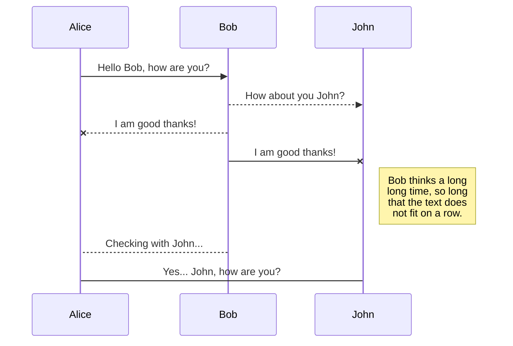
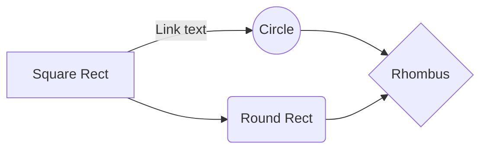

инструменты онлайн

[Free Markdown to HTML Converter](https://markdowntohtml.com/)

---

    tags: [wiktionary-семантика]
    source: https://ru.wiktionary.org/wiki/%D1%81%D0%B5%D0%BC%D0%B0%D0%BD%D1%82%D0%B8%D0%BA%D0%B0
    created: 2023-05-22T06:47:50.205Z

---

# GitHub Flavored Markdown Spec

[линк-якорный — link-anchor](#линк-якорный---link-anchor)

.

.

.

.

Чтобы создать заголовок, добавьте от одного до шести символов "#" перед текстом заголовка. Количество символов "#" определяет размер заголовка.

# This is an h1 tag

## This is an h2 tag

### This is an h3 tag

#### This is an h4 tag

##### This is an h5 tag

###### This is an h6 tag

.

.

.

.

## линк-якорный - link-anchor

```
[линк-якорный — link-anchor](#линк-якорный---link-anchor)
# линк-якорный - link-anchor

[link](#link)␠ ␠
# link␣␣

[link I](#link-I)␣␣
# link I␣␣

[link'I](#linkI)
# link'I

[link'I I:](#linkI-I)
# link'I I:

[link'I I: I](#linkI-I-I)
# link'I I: I

[link'I I: I I](#linkI-I-I-I)
# link'I I: I I
```

```html
It's also possible to create named custom anchors, if for example you have a
bunch of (sub-)headings with the same name. To do this with a header insert an
HTML tag:

<h4 id="login-optional-fields">Optional Fields</h4>

Then link to it by the ID attribute: [see above](#login-optional-fields) Also
adding an anchor tag directly to the document works as well:

<a id="my-anchor"></a>

. . Также возможно создавать названные пользовательские якоря, если, например, у
вас есть куча (под-)заголовков с тем же именем. Чтобы сделать это с заголовком,
вставьте HTML -тег:

<h4 id="login-optional-fields">Optional Fields</h4>

Затем ссылка на него по атрибуту ID: [see above](#login-optional-fields) Также
работает якорный тег непосредственно в документ:

<a id="my-anchor"></a>
```

```html
[see above](#login-optional-fields-2)
<div>
  <h4 id="login-optional-fields-2">Optional Fields</h4>
</div>

[my-anchor](#my-anchor)
<div>
  <a id="my-anchor">my anchor</a>
</div>
```

.

.

.

.

## сноски (статус выясняеца)

Some text with a footnote.[^i]

Some text with a footnote.[^ii]

Some text with a footnote.[^iii]

[^i]: The footnote.
[^ii]: The footnote.
[^iii]: The footnote.

.

.

.

.

.

.

.

.

.

.

.

.

.

.

.

.

.

.

.

.

.

.

.

.

.

.

.

.

.

.

.

.

.

.

.

.

.

.

.

.

.

.

.

.

.

.

.

.

.

.

.

.

.

.

.

.

## Шпаргалка по Markdown

(перевод, [оригинал](https://github.com/adam-p/markdown-here/wiki/Markdown-Cheatsheet))

Поиграть с разметкой Markdown можно на [демо-странице](http://www.markdown-here.com/livedemo.html).

##### Содержание

[Заголовки](#headers)  
[Выделение](#emphasis)  
[Списки](#lists)  
[Ссылки](#links)  
[Изображения](#images)  
[Подсветка кода и синтаксиса](#code)  
[Таблицы](#tables)  
[Цитаты](#blockquotes)  
[Встроенный HTML](#html)  
[Горизонтальная линия](#hr)  
[Новая строка](#lines)  
[Видео Youtube](#videos)

<a name="headers"><h2>Заголовки</h2></a>

```no-highlight
# H1
## H2
### H3
#### H4
##### H5
###### H6

Кроме того, H1 и H2 можно обозначить подчеркиванием:

Alt-H1
======

Alt-H2
------
```

# H1

## H2

### H3

#### H4

##### H5

###### H6

Кроме того, заголовки H1 и H2 можно обозначить подчеркиванием:

# Alt-H1

## Alt-H2

<a name="emphasis"><h2>Выделение</h2></a>

```no-highlight
Курсив обозначается *звездочками* или _подчеркиванием_.

Полужирный шрифт - двойными **звездочками** или __подчеркиванием__.

Комбинированное выделение **звездочками и _подчеркиванием_**.

Для зачеркнутого текста используются две тильды . ~~Уберите это.~~
```

Курсив обозначается _звездочками_ или _подчеркиванием_.

Полужирный шрифт - двойными **звездочками** или **подчеркиванием**.

Комбинированное выделение **звездочками и _подчеркиванием_**.

Для зачеркнутого текста используются две тильды . ~~Уберите это.~~

<a name="lists"><h2>Списки</h2></a>

(В данном примере предшествующие и завершающие пробелы обозначены точками: ⋅)

```no-highlight
1. Первый пункт нумерованного списка
2. Второй пункт
⋅⋅*Ненумерованный вложенный список.
1. Сами числа не имеют значения, лишь бы это были цифры
⋅⋅1. Нумерованный вложенный список
4. И еще один пункт.

⋅⋅⋅Внутри пунктов списка можно вставить абзацы с таким же отступом. Обратите внимание на пустую строку выше и на пробелы в начале (нужен по меньшей мере один, но здесь мы добавили три, чтобы также выровнять необработанный Markdown).

⋅⋅⋅Чтобы вставить разрыв строки, но не начинать новый параграф, нужно добавить два пробела перед новой строкой.⋅⋅
⋅⋅⋅Этот текст начинается с новой строки, но находится в том же абзаце.⋅⋅
⋅⋅⋅(В некоторых обработчиках, например на Github, пробелы в начале новой строки не нужны.)

* Ненумерованный список можно размечать звездочками
- Или минусами
+ Или плюсами
```

1. Первый пункт нумерованного списка
2. Второй пункт

- Ненумерованный вложенный список.

1. Сами числа не имеют значения, лишь бы это были цифры
1. Нумерованный вложенный список
1. И еще один пункт.

   Внутри пунктов списка можно вставить абзацы с таким же отступом. Обратите внимание на пустую строку выше и на пробелы в начале (нужен по меньшей мере один, но здесь мы добавили три, чтобы также выровнять необработанный Markdown).

   Чтобы вставить разрыв строки, но не начинать новый параграф, нужно добавить два пробела перед новой строкой.
   Эта текст начинается с новой строки, но находится в том же абзаце.
   (В некоторых обработчиках, например на Github, пробелы в начале новой строки не нужны.)

- Ненумерованный список можно размечать звездочками

* Или минусами

- Или плюсами

<a name="links"><h2>Ссылки</h2></a>

Ссылки можно оформить разными способами.

```no-highlight
[Обычная ссылка в строке](https://www.google.com)

[Обычная ссылка с title](https://www.google.com "Сайт Google")

[Ссылка со сноской][Произвольный регистронезависимый текст]

[Относительная ссылка на документ](../blob/master/LICENSE)

[Для ссылок со сноской можно использовать цифры][1]

Или можно просто вставить ссылку в квадратные скобки [текст ссылки]

Произвольный текст, после которого можно привести ссылки.

[произвольный регистронезависимый текст]: https://www.mozilla.org
[1]: http://slashdot.org
[текст ссылки]: http://www.reddit.com
```

[Обычная ссылка в строке](https://www.google.com)

[Обычная ссылка с title](https://www.google.com "Сайт Google")

[Ссылка со сноской][Произвольный регистронезависимый текст] \*

[Относительная ссылка на документ](../blob/master/LICENSE)

[Для ссылок со сноской можно использовать цифры][1]

Или можно просто вставить ссылку в квадратные скобки [текст ссылки]

Произвольный текст, после которого можно привести ссылки.

[Произвольный регистронезависимый текст]: https://www.mozilla.org
[1]: http://slashdot.org

[текст ссылки]: http://www.reddit.com

(\*) Для символов не входящих в ASCII, например кириллицы, текст сноски все-таки регистрозависим (прим. перев.)

<a name="images"><h2>Изображения</h2></a>

```no-highlight
Вот наш логотип (наведите указатель, чтобы увидеть текст заголовка):

Внутри строки:


В сноске:
![alt-текст][logo]

[logo]: https://github.com/adam-p/markdown-here/raw/master/src/common/images/icon48.png "Текст заголовка логотипа 2"
```

Вот наш логотип (наведите указатель, чтобы увидеть текст заголовка):

Внутри строки:  


В сноске:  
![alt-текст][logo]

[logo]: https://github.com/adam-p/markdown-here/raw/master/src/common/images/icon48.png "Текст заголовка логотипа 2"

<a name="code"><h2>Код и подсветка синтаксиса</h2></a>

Блоки кода являются частью функций Markdown, но не подсветка синтаксиса. Однако многие обработчики, например Github или _Markdown Here_, поддерживают подсветку синтаксиса. Список поддерживаемых языков и способ их указания может различаться. _Markdown Here_ поддерживает десятки языков (и не-языков, например синтаксис diff и заголовки HTTP); полный список и способ указания языков см. на странице [highlight.js demo-странице](http://softwaremaniacs.org/media/soft/highlight/test.html).

```no-highlight
`Код` в строке обрамляется `обратными апострофами`.
```

`Код` в строке обрамляется `обратными апострофами`.

Блоки кода выделяются либо тремя обратными апострофами <code>```</code> либо четырьмя пробелами в каждой строке. Рекомендуется использовать три апострофа -- они проще и только они поддерживают подсветку синтаксиса.

<pre lang="no-highlight"><code>```javascript
var s = "Подсветка JavaScript";
alert(s);
```
 
```python
s = "Подсветка Python"
print s
```
 
```
Язык не указан, синтаксис не подсвечен.
Но мы вставим в него &lt;b&gt;тег&lt;/b&gt;.
```
</code></pre>

```javascript
var s = "Подсветка JavaScript";
alert(s);
```

```python
s = "Подсветка Python"
print s
```

```
Язык не указан, синтаксис не подсвечен (некоторые обработчики все же подсвечивают).
Но мы вставим в него <b>тег</b>.
```

<a name="tables"><h2>Таблицы</h2></a>

Таблицы не являются частью Markdown, но многие обработчики, например _Markdown Here_ и Github, поддерживают их. Они позволяют легко добавить таблицы в электронное письмо -- в других случаях для этого нужно копировать их из другого приложения.

```no-highlight
Вертикальные линии обозначают столбцы.

| Таблицы       | Это                | Круто |
| ------------- |:------------------:| -----:|
| столбец 3     | выровнен вправо    | $1600 |
| столбец 2     | выровнен по центру |   $12 |
| зебра-строки  | прикольные         |    $1 |

Внешние вертикальные линии (|) не обязательны и нужны только, чтобы сам код Markdown выглядел красиво. Тот же код можно записать так:

Markdown | не такой | красивый
--- | --- | ---
*Но выводится* | `так же` | **клево**
1 | 2 | 3
```

Вертикальные линии обозначают столбцы.

| Таблицы      |        Это         | Круто |
| ------------ | :----------------: | ----: |
| столбец 3    |  выровнен вправо   | $1600 |
| столбец 2    | выровнен по центру |   $12 |
| зебра-строки |     прикольные     |    $1 |

Внешние вертикальные линии (|) не обязательны и нужны только, чтобы сам код Markdown выглядел красиво. Тот же код можно записать так:

| Markdown       | не такой | красивый  |
| -------------- | -------- | --------- |
| _Но выводится_ | `так же` | **клево** |
| 1              | 2        | 3         |

<a name="blockquotes"><h2>Цитаты</h2></a>

```no-highlight
> С помощью цитат очень удобно в письме обозначать исходный текст.
> Эта строка - часть той же цитаты.

Разрыв цитаты.

> Это очень длинная строка, но она будет правильно процитирована даже при размещении на нескольких строках. Продолжаем писать, чтобы эта строка не вмещалась на одной строке в любом окне. Кстати, в цитаты можно *вставлять* даже **Markdown**.
```

> С помощью цитат очень удобно в письме обозначать исходный текст.
> Эта строка - часть той же цитаты.

Разрыв цитаты.

> Это очень длинная строка, но она будет правильно процитирована даже при размещении на нескольких строках. Продолжаем писать, чтобы эта строка не вмещалась на одной строке в любом окне. Кстати, в цитаты можно также _размечать_ с помощью **Markdown**.

<a name="html"><h2>Встроенный HTML</h2></a>

Часто Markdown понимает чистый HTML.

```no-highlight
<dl>
  <dt>Список определений</dt>
  <dd>Это то, что люди иногда используют.</dd>

  <dt>Markdown внутри HTML</dt>
  <dd>Работает *не очень** хорошо. Используйте HTML-<em>теги</em>.</dd>
</dl>
```

<dl>
  <dt>Список определений</dt>
  <dd>Это то, что люди иногда используют.</dd>

  <dt>Markdown внутри HTML</dt>
  <dd>Работает *не очень** хорошо. Используйте HTML-<em>теги</em>.</dd>
</dl>

<a name="hr"><h2>Горизонтальные линии</h2></a>

```
Три и более...

---

Дефисы

***

Звездочки

___

Подчеркивания
```

Три и более...

---

Дефисы

---

Звездочки

---

Подчеркивания

<a name="lines"><h2>Новая строка</h2></a>

Для понимания работы разрыва строка автор главным образом рекомендует экспериментировать и пробовать -- нажмите &lt;Enter&gt; один раз (т.е. перейдите на новую строку), потом нажмите дважды (т.е. вставьте две новые строки) и посмотрите что приозошло. Вы сразу поймете что вам нужно. В расширении [Markdown Here](https://github.com/adam-p/markdown-here) для браузеров есть удобная функция "Markdown Toggle", которая поможет в этом.

_Примечание переводчика:_  
_Для переноса на новую строку в конце предыдущей строки необходимо добавить_ **два пробела**. _Без этого большинство парсеров Markdown не выполняют переход на новую строку._

Попробуйте ввести следующее:

```
Это начальная строка

Эта строка отделена от предыдущей двумя новыми строками и станет *отдельным абзацем*.

Это тоже отдельный абзац, но...⋅⋅
Эта строка отделена одной новой строкой, поэтому она находится в *том же абзаце*.
```

Это начальная строка

Эта строка отделена от предыдущей двумя новыми строками и станет _отдельным абзацем_.

Это тоже отдельный абзац, но...`[здесь два пробела]`  
Эта строка отделена одной новой строкой, поэтому она находится в _том же абзаце_.

(Примечание: В [Markdown Here](https://github.com/adam-p/markdown-here) разрывы строк ведут себя так же, как в [GFM](https://help.github.com/articles/github-flavored-markdown), поэтому не нужно вставлять по две новые строки.)

<a name="videos"><h2>Видео Youtube</h2></a>

Ролики нельзя вставить напрямую, но можно вставить изображение со ссылкой на видео, например:

```no-highlight
<a href="http://www.youtube.com/watch?feature=player_embedded&v=ID_ВИДЕОРОЛИКА_НА_YOUTUBE" target="_blank"></a>
```

На чистом Markdown, но без размеров изображения и рамки:

```no-highlight
[](http://www.youtube.com/watch?v=ID_ВИДЕОРОЛИКА_НА_YOUTUBE)
```

.

.

.

.

.

.

.

.

.

.

.

.

.

.

.

.

.

.

.

.

.

.

.

.

.

.

.

.

.

.

.

.

.

.

.

.

.

.

.

.

.

.

.

.

.

.

.

.

.

.

.

.

# Markdown Cheatsheet<a name="TOP"></a>

---

# Heading 1

    Markup :  # Heading 1 #

    -OR-

    Markup :  ============= (below H1 text)

## Heading 2

    Markup :  ## Heading 2 ##

    -OR-

    Markup: --------------- (below H2 text)

### Heading 3

    Markup :  ### Heading 3 ###

#### Heading 4

    Markup :  #### Heading 4 ####

Common text

    Markup :  Common text

_Emphasized text_

    Markup :  _Emphasized text_ or *Emphasized text*

~~Strikethrough text~~

    Markup :  ~~Strikethrough text~~

**Strong text**

    Markup :  __Strong text__ or **Strong text**

**_Strong emphasized text_**

    Markup :  ___Strong emphasized text___ or ***Strong emphasized text***

[Named Link](http://www.google.fr/ "Named link title") and http://www.google.fr/ or <http://example.com/>

    Markup :  [Named Link](http://www.google.fr/ "Named link title") and http://www.google.fr/ or <http://example.com/>

[heading-1](#heading-1 "Goto heading-1")

    Markup: [heading-1](#heading-1 "Goto heading-1")

Table, like this one :

| First Header | Second Header |
| ------------ | ------------- |
| Content Cell | Content Cell  |
| Content Cell | Content Cell  |

```
First Header  | Second Header
------------- | -------------
Content Cell  | Content Cell
Content Cell  | Content Cell
```

Adding a pipe `|` in a cell :

| First Header | Second Header |
| ------------ | ------------- |
| Content Cell | Content Cell  |
| Content Cell | \|            |

```
First Header  | Second Header
------------- | -------------
Content Cell  | Content Cell
Content Cell  |  \|
```

Left, right and center aligned table

| Left aligned Header | Right aligned Header | Center aligned Header |
| :------------------ | -------------------: | :-------------------: |
| Content Cell        |         Content Cell |     Content Cell      |
| Content Cell        |         Content Cell |     Content Cell      |

```
Left aligned Header | Right aligned Header | Center aligned Header
| :--- | ---: | :---:
Content Cell  | Content Cell | Content Cell
Content Cell  | Content Cell | Content Cell
```

`code()`

    Markup :  `code()`

```javascript
var specificLanguage_code = {
  data: {
    lookedUpPlatform: 1,
    query: "Kasabian+Test+Transmission",
    lookedUpItem: {
      name: "Test Transmission",
      artist: "Kasabian",
      album: "Kasabian",
      picture: null,
      link: "http://open.spotify.com/track/5jhJur5n4fasblLSCOcrTp",
    },
  },
};
```

    Markup : ```javascript
             ```

- Bullet list
  - Nested bullet
    - Sub-nested bullet etc
- Bullet list item 2

```
 Markup : * Bullet list
              * Nested bullet
                  * Sub-nested bullet etc
          * Bullet list item 2

-OR-

 Markup : - Bullet list
              - Nested bullet
                  - Sub-nested bullet etc
          - Bullet list item 2
```

1. A numbered list
   1. A nested numbered list
   2. Which is numbered
2. Which is numbered

```
 Markup : 1. A numbered list
              1. A nested numbered list
              2. Which is numbered
          2. Which is numbered
```

- [ ] An uncompleted task
- [x] A completed task

```
 Markup : - [ ] An uncompleted task
          - [x] A completed task
```

- [ ] An uncompleted task
  - [ ] A subtask

```
 Markup : - [ ] An uncompleted task
              - [ ] A subtask
```

> Blockquote
>
> > Nested blockquote

    Markup :  > Blockquote
              >> Nested Blockquote

_Horizontal line :_

---

    Markup :  - - - -

_Image with alt :_


    Markup : 

Foldable text:

<details>
  <summary>Title 1</summary>
  <p>Content 1 Content 1 Content 1 Content 1 Content 1</p>
</details>
<details>
  <summary>Title 2</summary>
  <p>Content 2 Content 2 Content 2 Content 2 Content 2</p>
</details>

    Markup : <details>
               <summary>Title 1</summary>
               <p>Content 1 Content 1 Content 1 Content 1 Content 1</p>
             </details>

```html
<h3>HTML</h3>
<p>Some HTML code here</p>
```

Link to a specific part of the page:

[Go To TOP](#TOP)

    Markup : [text goes here](#section_name)
              section_title<a name="section_name"></a>

Hotkey:

<kbd>⌘F</kbd>

<kbd>⇧⌘F</kbd>

    Markup : <kbd>⌘F</kbd>

Hotkey list:

| Key       | Symbol |
| --------- | ------ |
| Option    | ⌥      |
| Control   | ⌃      |
| Command   | ⌘      |
| Shift     | ⇧      |
| Caps Lock | ⇪      |
| Tab       | ⇥      |
| Esc       | ⎋      |
| Power     | ⌽      |
| Return    | ↩      |
| Delete    | ⌫      |
| Up        | ↑      |
| Down      | ↓      |
| Left      | ←      |
| Right     | →      |

Emoji:

:exclamation: Use emoji icons to enhance text. :+1: Look up emoji codes at [emoji-cheat-sheet.com](http://emoji-cheat-sheet.com/)

    Markup : Code appears between colons :EMOJICODE:

.

.

.

.

.

.

.

.

.

.

.

.

.

.

.

.

.

.

.

.

.

.

.

.

.

.

.

.

.

.

.

.

.

.

.

.

.

.

.

.

.

.

.

.

.

.

.

.

.

.

# **HTML**


.

.

.

.

.

.

.

.

.

.

.

.

.

.

.

.

.

.

.

.

.

.

.

.

.

.

.

.

.

.

.

.

.

.

.

.

.

.

.

.

.

.

# Markdown-cheatsheet

Best Markdown cheat sheet ever made with HTML

## Best IDE

- [stackedit](https://stackedit.io/)
- [readme so](https://readme.so/editor)
- [markdown to html](https://readme.so/editor)

## 🔗 Youtube Video Links

[](#)

## Index

| components name        | link     | language (html+markdown) |
| :--------------------- | :------- | :----------------------- |
| `Headings`             | [view]() | html+markdown            |
| `text style`           | [view]() | html+markdown            |
| `Horizontal Rule`      | [View]() | html+markdown            |
| `Links`                | [View]() | html+markdown            |
| `List`                 | [View]() | html+markdown            |
| `Inline Code Block`    | [View]() | html+markdown            |
| ` Images`              | [View]() | html+markdown            |
| `Github code Markdown` | [View]() | html+markdown            |

# Headings

<!--HTML heading-->
<h1> heading 1 </h1>
<h2> heading 2</h2>
<h3> heading 3</h3>
<h4> heading 4</h4>
<h5> heading 5</h5>
<h6> heading 6</h6>

<!--Markdown heading -->

# heading 1

## heading 2

### heading 3

#### heading 4

##### heading 5

###### heading

<!-- Italics -->

<!--HTML Italics -->

This is a <i>Italic </i> text

<!--Markdown Italics -->

This is a _Italic_ text

<!-- Strong -->

**This text** is italic

**This text** is italic

<!--HTML bold -->

This is a <b>bold </b> text

<!--Markdown Bold -->

This is a **bold** text

<!-- Blockquote -->

> This is a quote

<!-- Strikethrough -->

~~This text~~ is strikethrough

# Horizontal Rule

<!--HTML  Horizontal Rule-->

<hr>
<!--Markdown Horizontal Rule-->

---

---

<!-- Links -->

[The Terminal Boy](https://www.youtube.com/c/TheTerminalBoy)

# List (order unorder )

 <p> order list </p>
<!--HTML  OL-->
<ol>
<li>this is one</li>
<li>this is two</li>
<li>this is three</li>
</ol>

<!--Markdown OL-->

- this is one
- this is two
- this is three

 <p> Un order list </p>
<!--HTML  UL-->
<ul>
<li>this is one</li>
<li>this is two</li>
<li>this is three</li>
</ul>

<!--Markdown UL-->

- Item 1
- item 2
- Item 3
  - Nested item 4
  - Nested Item 5

<!-- Inline Code Block -->

`<p>This is a paragraph</p>`

<!-- Images -->

# Images

<!--HTML  Images-->


<!--Markdown img-->


<!-- Github Markdown -->

<!-- Code Blocks -->

```bash
  npm install

  npm start
```

```javascript
function add(num1, num2) {
  return num1 + num2;
}
```

```python
  def add(num1, num2):
    return num1 + num2
```

<!-- Tables -->

# Table

<!--HTML  table-->
<p> Table </p>
<table border="1">
<tr>
<td>1</td>
<td>2</td>
<td>3</td>
<tr>
<tr>
<td>4</td>
<td>5</td>
<td>6</td>
<tr>
</table>

<br>
<!--Markdown table-->

| name  | ID   |
| ----- | ---- |
| rahul | 2000 |
| rahul | 2000 |
| rahul | 2000 |

<!-- Task List -->

- [x] Task 1
- [x] Task 2
- [ ] Task 3

## SmartyPants

SmartyPants converts ASCII punctuation characters into "smart" typographic punctuation HTML entities. For example:

|                  | ASCII                           | HTML                          |
| ---------------- | ------------------------------- | ----------------------------- |
| Single backticks | `'Isn't this fun?'`             | 'Isn't this fun?'             |
| Quotes           | `"Isn't this fun?"`             | "Isn't this fun?"             |
| Dashes           | `-- is en-dash, --- is em-dash` | -- is en-dash, --- is em-dash |

## Github math

When $a \ne 0$, there are two solutions to $(ax^2 + bx + c = 0)$ and they are
$$ x = {-b \pm \sqrt{b^2-4ac} \over 2a} $$

## KaTeX

You can render LaTeX mathematical expressions using [KaTeX](https://khan.github.io/KaTeX/):

The _Gamma function_ satisfying $\Gamma(n) = (n-1)!\quad\forall n\in\mathbb N$ is via the Euler integral

$$
\Gamma(z) = \int_0^\infty t^{z-1}e^{-t}dt\,.
$$

> You can find more information about **LaTeX** mathematical expressions [here](http://meta.math.stackexchange.com/questions/5020/mathjax-basic-tutorial-and-quick-reference).

## UML diagrams

You can render UML diagrams using [Mermaid](https://mermaidjs.github.io/). For example, this will produce a sequence diagram:



And this will produce a flow chart:

[Visit Doc](https://rich-iannone.github.io/DiagrammeR/mermaid.html)



.

.

.

.

.

.

.

.

.

.

.

.

.

.

.

.

.

.

.

.

.

.

.

.

.

.

.

.

[Free Markdown to HTML Converter](https://markdowntohtml.com/)

.

HTML

.

<hr>
<pre><code>tags: [wiktionary-семантика]
source: https:<span class="hljs-regexp">//ru</span>.wiktionary.org/wiki/%D1%81%D0%B5%D0%BC%D0%B0%D0%BD%D1%82%D0%B8%D0%BA%D0%B0
created: <span class="hljs-number">2023</span>-<span class="hljs-number">05</span>-<span class="hljs-number">22</span>T06:<span class="hljs-number">47</span>:<span class="hljs-number">50.205</span>Z
</code></pre><hr>
<h1 id="github-flavored-markdown-spec">GitHub Flavored Markdown Spec</h1>
<p><a href="#линк-якорный---link-anchor">линк-якорный — link-anchor</a></p>
<p>.</p>
<p>.</p>
<p>.</p>
<p>.</p>
<p>Чтобы создать заголовок, добавьте от одного до шести символов &quot;#&quot; перед текстом заголовка. Количество символов &quot;#&quot; определяет размер заголовка.</p>
<h1 id="this-is-an-h1-tag">This is an h1 tag</h1>
<h2 id="this-is-an-h2-tag">This is an h2 tag</h2>
<h3 id="this-is-an-h3-tag">This is an h3 tag</h3>
<h4 id="this-is-an-h4-tag">This is an h4 tag</h4>
<h5 id="this-is-an-h5-tag">This is an h5 tag</h5>
<h6 id="this-is-an-h6-tag">This is an h6 tag</h6>
<p>.</p>
<p>.</p>
<p>.</p>
<p>.</p>
<h2 id="-link-anchor">линк-якорный - link-anchor</h2>
<pre><code>[<span class="hljs-string">линк-якорный — link-anchor</span>](<span class="hljs-link">#линк-якорный---link-anchor</span>)
<span class="hljs-section"># линк-якорный - link-anchor</span>

[<span class="hljs-string">link</span>](<span class="hljs-link">#link</span>)␠ ␠
<span class="hljs-section"># link␣␣</span>

[<span class="hljs-string">link I</span>](<span class="hljs-link">#link-I</span>)␣␣
<span class="hljs-section"># link I␣␣</span>

[<span class="hljs-string">link'I</span>](<span class="hljs-link">#linkI</span>)
<span class="hljs-section"># link'I</span>

[<span class="hljs-string">link'I I:</span>](<span class="hljs-link">#linkI-I</span>)
<span class="hljs-section"># link'I I:</span>

[<span class="hljs-string">link'I I: I</span>](<span class="hljs-link">#linkI-I-I</span>)
<span class="hljs-section"># link'I I: I</span>

[<span class="hljs-string">link'I I: I I</span>](<span class="hljs-link">#linkI-I-I-I</span>)
<span class="hljs-section"># link'I I: I I</span>
</code></pre><pre><code class="lang-html">It's also possible to <span class="hljs-keyword">create</span> named custom anchors, <span class="hljs-keyword">if</span> <span class="hljs-keyword">for</span> example you have a
bunch <span class="hljs-keyword">of</span> (sub-)headings <span class="hljs-keyword">with</span> the same name. <span class="hljs-keyword">To</span> <span class="hljs-keyword">do</span> this <span class="hljs-keyword">with</span> a header <span class="hljs-keyword">insert</span> an
HTML tag:

&lt;h4 <span class="hljs-keyword">id</span>=<span class="hljs-string">"login-optional-fields"</span>&gt;Optional <span class="hljs-keyword">Fields</span>&lt;/h4&gt;

<span class="hljs-keyword">Then</span> <span class="hljs-keyword">link</span> <span class="hljs-keyword">to</span> it <span class="hljs-keyword">by</span> the <span class="hljs-keyword">ID</span> <span class="hljs-keyword">attribute</span>: [see above](#login-optional-<span class="hljs-keyword">fields</span>) Also
adding an anchor tag directly <span class="hljs-keyword">to</span> the <span class="hljs-keyword">document</span> works <span class="hljs-keyword">as</span> well:

&lt;a <span class="hljs-keyword">id</span>=<span class="hljs-string">"my-anchor"</span>&gt;&lt;/a&gt;

. . Также возможно создавать названные пользовательские якоря, если, например, у
вас есть куча (под-)заголовков с тем же именем. Чтобы сделать это с заголовком,
вставьте HTML -тег:

&lt;h4 <span class="hljs-keyword">id</span>=<span class="hljs-string">"login-optional-fields"</span>&gt;Optional <span class="hljs-keyword">Fields</span>&lt;/h4&gt;

Затем ссылка на него по атрибуту <span class="hljs-keyword">ID</span>: [see above](#login-optional-<span class="hljs-keyword">fields</span>) Также
работает якорный тег непосредственно в документ:

&lt;a <span class="hljs-keyword">id</span>=<span class="hljs-string">"my-anchor"</span>&gt;&lt;/a&gt;
</code></pre>

<pre><code class="lang-html">[<span class="hljs-string">see above</span>](<span class="hljs-link">#login-optional-fields-2</span>)
<span class="xml"><span class="hljs-tag">&lt;<span class="hljs-name">div</span>&gt;</span></span>
  <span class="xml"><span class="hljs-tag">&lt;<span class="hljs-name">h4</span> <span class="hljs-attr">id</span>=<span class="hljs-string">"login-optional-fields-2"</span>&gt;</span></span>Optional Fields<span class="xml"><span class="hljs-tag">&lt;/<span class="hljs-name">h4</span>&gt;</span></span>
<span class="xml"><span class="hljs-tag">&lt;/<span class="hljs-name">div</span>&gt;</span></span>

[<span class="hljs-string">my-anchor</span>](<span class="hljs-link">#my-anchor</span>)
<span class="xml"><span class="hljs-tag">&lt;<span class="hljs-name">div</span>&gt;</span></span>
  <span class="xml"><span class="hljs-tag">&lt;<span class="hljs-name">a</span> <span class="hljs-attr">id</span>=<span class="hljs-string">"my-anchor"</span>&gt;</span></span>my anchor<span class="xml"><span class="hljs-tag">&lt;/<span class="hljs-name">a</span>&gt;</span></span>
<span class="xml"><span class="hljs-tag">&lt;/<span class="hljs-name">div</span>&gt;</span></span>
</code></pre>
<p>.</p>
<p>.</p>
<p>.</p>
<p>.</p>
<p>Some text with a footnote.[^i]</p>
<p>Some text with a footnote.[^ii]</p>
<p>Some text with a footnote.[^iii]</p>
<p>[^i]: The footnote.</p>
<p>[^ii]: The footnote.</p>
<p>[^iii]: The footnote.</p>
<p>.</p>
<p>.</p>
<p>.</p>
<p>.</p>
<p>.</p>
<p>.</p>
<p>.</p>
<p>.</p>
<p>.</p>
<p>.</p>
<p>.</p>
<p>.</p>
<p>.</p>
<p>.</p>
<p>.</p>
<p>.</p>
<p>.</p>
<p>.</p>
<p>.</p>
<p>.</p>
<p>.</p>
<p>.</p>
<p>.</p>
<p>.</p>
<p>.</p>
<p>.</p>
<p>.</p>
<p>.</p>
<p>.</p>
<p>.</p>
<p>.</p>
<p>.</p>
<p>.</p>
<p>.</p>
<p>.</p>
<p>.</p>
<p>.</p>
<p>.</p>
<p>.</p>
<p>.</p>
<p>.</p>
<p>.</p>
<p>.</p>
<p>.</p>
<p>.</p>
<p>.</p>
<p>.</p>
<p>.</p>
<p>.</p>
<p>.</p>
<p>.</p>
<p>.</p>
<p>.</p>
<p>.</p>
<p>.</p>
<p>.</p>
<h2 id="-markdown">Шпаргалка по Markdown</h2>
<p>(перевод, <a href="https://github.com/adam-p/markdown-here/wiki/Markdown-Cheatsheet">оригинал</a>)</p>
<p>Поиграть с разметкой Markdown можно на <a href="http://www.markdown-here.com/livedemo.html">демо-странице</a>.</p>
<h5 id="-">Содержание</h5>
<p><a href="#headers">Заголовки</a><br><a href="#emphasis">Выделение</a><br><a href="#lists">Списки</a><br><a href="#links">Ссылки</a><br><a href="#images">Изображения</a><br><a href="#code">Подсветка кода и синтаксиса</a><br><a href="#tables">Таблицы</a><br><a href="#blockquotes">Цитаты</a><br><a href="#html">Встроенный HTML</a><br><a href="#hr">Горизонтальная линия</a><br><a href="#lines">Новая строка</a><br><a href="#videos">Видео Youtube</a></p>
<p><a name="headers"><h2>Заголовки</h2></a></p>
<pre><code class="lang-no-highlight"># H1
## H2
### H3
#### H4
##### H5
###### H6

Кроме того, H1 и H2 можно обозначить подчеркиванием:

# Alt-H1

## Alt-H2

</code></pre>

<h1 id="h1">H1</h1>
<h2 id="h2">H2</h2>
<h3 id="h3">H3</h3>
<h4 id="h4">H4</h4>
<h5 id="h5">H5</h5>
<h6 id="h6">H6</h6>
<p>Кроме того, заголовки H1 и H2 можно обозначить подчеркиванием:</p>
<h1 id="alt-h1">Alt-H1</h1>
<h2 id="alt-h2">Alt-H2</h2>
<p><a name="emphasis"><h2>Выделение</h2></a></p>
<pre><code class="lang-no-highlight">Курсив обозначается *звездочками* или <span class="hljs-symbol">_</span>подчеркиванием<span class="hljs-symbol">_</span>.

Полужирный шрифт - двойными **звездочками** или <span class="hljs-symbol">**</span>подчеркиванием<span class="hljs-symbol">**</span>.

Комбинированное выделение **звездочками и <span class="hljs-symbol">_</span>подчеркиванием<span class="hljs-symbol">_</span>**.

Для зачеркнутого текста используются две тильды . ~~Уберите это.~~
</code></pre>

<p>Курсив обозначается <em>звездочками</em> или <em>подчеркиванием</em>.</p>
<p>Полужирный шрифт - двойными <strong>звездочками</strong> или <strong>подчеркиванием</strong>.</p>
<p>Комбинированное выделение <strong>звездочками и <em>подчеркиванием</em></strong>.</p>
<p>Для зачеркнутого текста используются две тильды . <del>Уберите это.</del></p>
<p><a name="lists"><h2>Списки</h2></a></p>
<p>(В данном примере предшествующие и завершающие пробелы обозначены точками: ⋅)</p>
<pre><code class="lang-no-highlight"><span class="hljs-number">1</span>. Первый пункт нумерованного списка
<span class="hljs-number">2</span>. Второй пункт
⋅⋅*Ненумерованный вложенный список.
<span class="hljs-number">1</span>. Сами числа <span class="hljs-keyword">не</span> имеют значения, лишь бы это были цифры
⋅⋅<span class="hljs-number">1</span>. Нумерованный вложенный список
<span class="hljs-number">4</span>. <span class="hljs-keyword">И</span> еще один пункт.

⋅⋅⋅Внутри пунктов списка можно вставить абзацы с таким же отступом. Обратите внимание на пустую строку выше <span class="hljs-keyword">и</span> на пробелы в начале (нужен <span class="hljs-keyword">по</span> меньшей мере один, но здесь мы добавили три, чтобы также выровнять необработанный Markdown).

⋅⋅⋅Чтобы вставить разрыв строки, но <span class="hljs-keyword">не</span> начинать новый параграф, нужно добавить два пробела перед новой строкой.⋅⋅
⋅⋅⋅Этот текст начинается с новой строки, но находится в том же абзаце.⋅⋅
⋅⋅⋅(В некоторых обработчиках, например на Github, пробелы в начале новой строки <span class="hljs-keyword">не</span> нужны.)

- Ненумерованный список можно размечать звездочками

* <span class="hljs-keyword">Или</span> минусами

- <span class="hljs-keyword">Или</span> плюсами
</code></pre>
<ol>
<li>Первый пункт нумерованного списка</li>
<li><p>Второй пункт</p>
</li>
<li><p>Ненумерованный вложенный список.</p>
</li>
<li><p>Сами числа не имеют значения, лишь бы это были цифры</p>
</li>
<li>Нумерованный вложенный список</li>
<li><p>И еще один пункт.</p>
<p>Внутри пунктов списка можно вставить абзацы с таким же отступом. Обратите внимание на пустую строку выше и на пробелы в начале (нужен по меньшей мере один, но здесь мы добавили три, чтобы также выровнять необработанный Markdown).</p>
<p>Чтобы вставить разрыв строки, но не начинать новый параграф, нужно добавить два пробела перед новой строкой.
Эта текст начинается с новой строки, но находится в том же абзаце.
(В некоторых обработчиках, например на Github, пробелы в начале новой строки не нужны.)</p>
</li>
<li><p>Ненумерованный список можно размечать звездочками</p>
</li>
<li><p>Или минусами</p>
</li>
<li><p>Или плюсами</p>
</li>
</ol>
<p><a name="links"><h2>Ссылки</h2></a></p>
<p>Ссылки можно оформить разными способами.</p>
<pre><code class="lang-no-highlight">[<span class="hljs-string">Обычная ссылка в строке</span>](<span class="hljs-link">https://www.google.com</span>)

[<span class="hljs-string">Обычная ссылка с title</span>](<span class="hljs-link">https://www.google.com "Сайт Google"</span>)

[<span class="hljs-string">Ссылка со сноской</span>][<span class="hljs-symbol">Произвольный регистронезависимый текст</span>]

[<span class="hljs-string">Относительная ссылка на документ</span>](<span class="hljs-link">../blob/master/LICENSE</span>)

[<span class="hljs-string">Для ссылок со сноской можно использовать цифры</span>][<span class="hljs-symbol">1</span>]

Или можно просто вставить ссылку в квадратные скобки [текст ссылки]

Произвольный текст, после которого можно привести ссылки.

[<span class="hljs-symbol">произвольный регистронезависимый текст</span>]: <span class="hljs-link">https://www.mozilla.org</span>
[<span class="hljs-symbol">1</span>]: <span class="hljs-link">http://slashdot.org</span>
[<span class="hljs-symbol">текст ссылки</span>]: <span class="hljs-link">http://www.reddit.com</span>
</code></pre>

<p><a href="https://www.google.com">Обычная ссылка в строке</a></p>
<p><a href="https://www.google.com" title="Сайт Google">Обычная ссылка с title</a></p>
<p><a href="https://www.mozilla.org">Ссылка со сноской</a> *</p>
<p><a href="../blob/master/LICENSE">Относительная ссылка на документ</a></p>
<p><a href="http://slashdot.org">Для ссылок со сноской можно использовать цифры</a></p>
<p>Или можно просто вставить ссылку в квадратные скобки <a href="http://www.reddit.com">текст ссылки</a></p>
<p>Произвольный текст, после которого можно привести ссылки.</p>
<p>(*) Для символов не входящих в ASCII, например кириллицы, текст сноски все-таки регистрозависим (прим. перев.)</p>
<p><a name="images"><h2>Изображения</h2></a></p>
<pre><code class="lang-no-highlight">Вот наш логотип (наведите указатель, чтобы увидеть текст заголовка):

Внутри строки:


В сноске:
![<span class="hljs-string">alt-текст</span>][<span class="hljs-symbol">logo</span>]

[<span class="hljs-symbol">logo</span>]: <span class="hljs-link">https://github.com/adam-p/markdown-here/raw/master/src/common/images/icon48.png "Текст заголовка логотипа 2"</span>
</code></pre>

<p>Вот наш логотип (наведите указатель, чтобы увидеть текст заголовка):</p>
<p>Внутри строки:<br></p>
<p>В сноске:<br></p>
<p><a name="code"><h2>Код и подсветка синтаксиса</h2></a></p>
<p>Блоки кода являются частью функций Markdown, но не подсветка синтаксиса. Однако многие обработчики, например Github или <em>Markdown Here</em>, поддерживают подсветку синтаксиса. Список поддерживаемых языков и способ их указания может различаться. <em>Markdown Here</em> поддерживает десятки языков (и не-языков, например синтаксис diff и заголовки HTTP); полный список и способ указания языков см. на странице <a href="http://softwaremaniacs.org/media/soft/highlight/test.html">highlight.js demo-странице</a>.</p>
<pre><code class="lang-no-highlight">`Код` в строке обрамляется `обратными апострофами`.
</code></pre>
<p><code>Код</code> в строке обрамляется <code>обратными апострофами</code>.</p>
<p>Блоки кода выделяются либо тремя обратными апострофами <code>```</code> либо четырьмя пробелами в каждой строке. Рекомендуется использовать три апострофа -- они проще и только они поддерживают подсветку синтаксиса.</p>
<pre lang="no-highlight"><code>```javascript
var s = "Подсветка JavaScript";
alert(s);
```

```python
s = "Подсветка Python"
print s
```

```
Язык не указан, синтаксис не подсвечен.
Но мы вставим в него &lt;b&gt;тег&lt;/b&gt;.
```

</code></pre>

<pre><code class="lang-javascript">var s = <span class="hljs-string">"Подсветка JavaScript"</span><span class="hljs-comment">;</span>
alert(s)<span class="hljs-comment">;</span>
</code></pre>
<pre><code class="lang-python">s = <span class="hljs-string">"Подсветка Python"</span>
<span class="hljs-keyword">print</span> <span class="hljs-built_in">s</span>
</code></pre>
<pre><code>Язык <span class="hljs-keyword">не</span> указан, синтаксис <span class="hljs-keyword">не</span> подсвечен (некоторые обработчики все же подсвечивают).
Но мы вставим в него &lt;b&gt;тег&lt;/b&gt;.
</code></pre><p><a name="tables"><h2>Таблицы</h2></a></p>
<p>Таблицы не являются частью Markdown, но многие обработчики, например <em>Markdown Here</em> и Github, поддерживают их. Они позволяют легко добавить таблицы в электронное письмо -- в других случаях для этого нужно копировать их из другого приложения.</p>
<pre><code class="lang-no-highlight">Вертикальные линии обозначают столбцы.

<span class="hljs-params">| Таблицы |</span> Это <span class="hljs-params">| Круто |</span>
<span class="hljs-params">| ------------- |</span><span class="hljs-symbol">:------------------</span><span class="hljs-symbol">:|</span> -----<span class="hljs-symbol">:|</span>
<span class="hljs-params">| столбец 3 |</span> выровнен вправо <span class="hljs-params">| $1600 |</span>
<span class="hljs-params">| столбец 2 |</span> выровнен по центру <span class="hljs-params">| $12 |</span>
<span class="hljs-params">| зебра-строки |</span> прикольные <span class="hljs-params">| $1 |</span>

Внешние вертикальные линии (<span class="hljs-params">|) не обязательны и нужны только, чтобы сам код Markdown выглядел красиво. Тот же код можно записать так:

Markdown |</span> не такой <span class="hljs-params">| красивый
--- |</span> --- <span class="hljs-params">| ---
_Но выводится_ |</span> <span class="hljs-string">`так же`</span> <span class="hljs-params">| **клево**
1 |</span> <span class="hljs-number">2</span> <span class="hljs-params">| 3</span>
</code></pre>

<p>Вертикальные линии обозначают столбцы.</p>
<table>
<thead>
<tr>
<th>Таблицы</th>
<th style="text-align:center">Это</th>
<th style="text-align:right">Круто</th>
</tr>
</thead>
<tbody>
<tr>
<td>столбец 3</td>
<td style="text-align:center">выровнен вправо</td>
<td style="text-align:right">$1600</td>
</tr>
<tr>
<td>столбец 2</td>
<td style="text-align:center">выровнен по центру</td>
<td style="text-align:right">$12</td>
</tr>
<tr>
<td>зебра-строки</td>
<td style="text-align:center">прикольные</td>
<td style="text-align:right">$1</td>
</tr>
</tbody>
</table>
<p>Внешние вертикальные линии (|) не обязательны и нужны только, чтобы сам код Markdown выглядел красиво. Тот же код можно записать так:</p>
<table>
<thead>
<tr>
<th>Markdown</th>
<th>не такой</th>
<th>красивый</th>
</tr>
</thead>
<tbody>
<tr>
<td><em>Но выводится</em></td>
<td><code>так же</code></td>
<td><strong>клево</strong></td>
</tr>
<tr>
<td>1</td>
<td>2</td>
<td>3</td>
</tr>
</tbody>
</table>
<p><a name="blockquotes"><h2>Цитаты</h2></a></p>
<pre><code class="lang-no-highlight">&gt; С помощью цитат очень удобно в письме обозначать исходный текст.
&gt; Эта <span class="hljs-keyword">строка</span> - часть той же цитаты.

Разрыв цитаты.

&gt; Это очень длинная <span class="hljs-keyword">строка</span>, но она будет правильно процитирована даже при размещении на нескольких строках. Продолжаем писать, чтобы эта <span class="hljs-keyword">строка</span> <span class="hljs-keyword">не</span> вмещалась на одной строке в любом окне. Кстати, в цитаты можно _вставлять_ даже **Markdown**.
</code></pre>

<blockquote>
<p>С помощью цитат очень удобно в письме обозначать исходный текст.
Эта строка - часть той же цитаты.</p>
</blockquote>
<p>Разрыв цитаты.</p>
<blockquote>
<p>Это очень длинная строка, но она будет правильно процитирована даже при размещении на нескольких строках. Продолжаем писать, чтобы эта строка не вмещалась на одной строке в любом окне. Кстати, в цитаты можно также <em>размечать</em> с помощью <strong>Markdown</strong>.</p>
</blockquote>
<p><a name="html"><h2>Встроенный HTML</h2></a></p>
<p>Часто Markdown понимает чистый HTML.</p>
<pre><code class="lang-no-highlight"><span class="hljs-tag">&lt;<span class="hljs-name">dl</span>&gt;</span>
  <span class="hljs-tag">&lt;<span class="hljs-name">dt</span>&gt;</span>Список определений<span class="hljs-tag">&lt;/<span class="hljs-name">dt</span>&gt;</span>
  <span class="hljs-tag">&lt;<span class="hljs-name">dd</span>&gt;</span>Это то, что люди иногда используют.<span class="hljs-tag">&lt;/<span class="hljs-name">dd</span>&gt;</span>

<span class="hljs-tag">&lt;<span class="hljs-name">dt</span>&gt;</span>Markdown внутри HTML<span class="hljs-tag">&lt;/<span class="hljs-name">dt</span>&gt;</span>
<span class="hljs-tag">&lt;<span class="hljs-name">dd</span>&gt;</span>Работает \*не очень\*\* хорошо. Используйте HTML-<span class="hljs-tag">&lt;<span class="hljs-name">em</span>&gt;</span>теги<span class="hljs-tag">&lt;/<span class="hljs-name">em</span>&gt;</span>.<span class="hljs-tag">&lt;/<span class="hljs-name">dd</span>&gt;</span>
<span class="hljs-tag">&lt;/<span class="hljs-name">dl</span>&gt;</span>
</code></pre>

<dl>
  <dt>Список определений</dt>
  <dd>Это то, что люди иногда используют.</dd>

  <dt>Markdown внутри HTML</dt>
  <dd>Работает <em>не очень*</em> хорошо. Используйте HTML-<em>теги</em>.</dd>
</dl>

<p><a name="hr"><h2>Горизонтальные линии</h2></a></p>
<pre><code>Три и более...

<span class="hljs-meta">---</span>

Дефисы

---

Звездочки

---

Подчеркивания
</code></pre><p>Три и более...</p>

<hr>
<p>Дефисы</p>
<hr>
<p>Звездочки</p>
<hr>
<p>Подчеркивания</p>
<p><a name="lines"><h2>Новая строка</h2></a></p>
<p>Для понимания работы разрыва строка автор главным образом рекомендует экспериментировать и пробовать -- нажмите &lt;Enter&gt; один раз (т.е. перейдите на новую строку), потом нажмите дважды (т.е. вставьте две новые строки) и посмотрите что приозошло. Вы сразу поймете что вам нужно. В расширении <a href="https://github.com/adam-p/markdown-here">Markdown Here</a> для браузеров есть удобная функция &quot;Markdown Toggle&quot;, которая поможет в этом.</p>
<p><em>Примечание переводчика:</em><br><em>Для переноса на новую строку в конце предыдущей строки необходимо добавить</em> <strong>два пробела</strong>. <em>Без этого большинство парсеров Markdown не выполняют переход на новую строку.</em></p>
<p>Попробуйте ввести следующее:</p>
<pre><code>Это начальная <span class="hljs-keyword">строка</span>

Эта <span class="hljs-keyword">строка</span> отделена от предыдущей двумя новыми строками <span class="hljs-keyword">и</span> станет _отдельным абзацем_.

Это тоже отдельный абзац, но...⋅⋅
Эта <span class="hljs-keyword">строка</span> отделена одной новой строкой, поэтому она находится в _том же абзаце_.
</code></pre><p>Это начальная строка</p>

<p>Эта строка отделена от предыдущей двумя новыми строками и станет <em>отдельным абзацем</em>.</p>
<p>Это тоже отдельный абзац, но...<code>[здесь два пробела]</code><br>Эта строка отделена одной новой строкой, поэтому она находится в <em>том же абзаце</em>.</p>
<p>(Примечание: В <a href="https://github.com/adam-p/markdown-here">Markdown Here</a> разрывы строк ведут себя так же, как в <a href="https://help.github.com/articles/github-flavored-markdown">GFM</a>, поэтому не нужно вставлять по две новые строки.)</p>
<p><a name="videos"><h2>Видео Youtube</h2></a></p>
<p>Ролики нельзя вставить напрямую, но можно вставить изображение со ссылкой на видео, например:</p>
<pre><code class="lang-no-highlight">&lt;<span class="hljs-selector-tag">a</span> href=<span class="hljs-string">"http://www.youtube.com/watch?feature=player_embedded&amp;v=ID_ВИДЕОРОЛИКА_НА_YOUTUBE"</span> target=<span class="hljs-string">"_blank"</span>&gt;&lt;<span class="hljs-selector-tag">img</span> src=<span class="hljs-string">"http://img.youtube.com/vi/ID_ВИДЕОРОЛИКА_НА_YOUTUBE/0.jpg"</span>
alt=<span class="hljs-string">"ALT-ТЕКСТ ИЗОБРАЖЕНИЯ"</span> <span class="hljs-attribute">width</span>=<span class="hljs-string">"240"</span> height=<span class="hljs-string">"180"</span> border=<span class="hljs-string">"10"</span> /&gt;&lt;/a&gt;
</code></pre>
<p>На чистом Markdown, но без размеров изображения и рамки:</p>
<pre><code class="lang-no-highlight">[<span class="hljs-string">](<span class="hljs-link">http://www.youtube.com/watch?v=ID_ВИДЕОРОЛИКА_НА_YOUTUBE</span>)
</code></pre>
<p>.</p>
<p>.</p>
<p>.</p>
<p>.</p>
<p>.</p>
<p>.</p>
<p>.</p>
<p>.</p>
<p>.</p>
<p>.</p>
<p>.</p>
<p>.</p>
<p>.</p>
<p>.</p>
<p>.</p>
<p>.</p>
<p>.</p>
<p>.</p>
<p>.</p>
<p>.</p>
<p>.</p>
<p>.</p>
<p>.</p>
<p>.</p>
<p>.</p>
<p>.</p>
<p>.</p>
<p>.</p>
<p>.</p>
<p>.</p>
<p>.</p>
<p>.</p>
<p>.</p>
<p>.</p>
<p>.</p>
<p>.</p>
<p>.</p>
<p>.</p>
<p>.</p>
<p>.</p>
<p>.</p>
<p>.</p>
<p>.</p>
<p>.</p>
<p>.</p>
<p>.</p>
<p>.</p>
<p>.</p>
<p>.</p>
<p>.</p>
<p>.</p>
<p>.</p>
<h1 id="markdown-cheatsheet-a-name-top-a-">Markdown Cheatsheet<a name="TOP"></a></h1>
<hr>
<h1 id="heading-1">Heading 1</h1>
<pre><code>Markup :  # <span class="hljs-type">Heading</span> <span class="hljs-number">1</span> #

-<span class="hljs-keyword">OR</span>-

Markup : ============= (<span class="hljs-type">below</span> H1 text)
</code></pre><h2 id="heading-2">Heading 2</h2>

<pre><code>Markup :  ## Heading <span class="hljs-number">2</span> ##

-OR-

Markup: --------------- (below H2 text)
</code></pre><h3 id="heading-3">Heading 3</h3>
<pre><code>Markup :  ### Heading <span class="hljs-number">3</span> ###
</code></pre><h4 id="heading-4">Heading 4</h4>
<pre><code>Markup :  #### Heading <span class="hljs-number">4</span> ####
</code></pre><p>Common text</p>
<pre><code><span class="hljs-keyword">Markup </span>:  <span class="hljs-meta">Common</span> text
</code></pre><p><em>Emphasized text</em></p>
<pre><code>Markup :  _<span class="hljs-type">Emphasized</span> text_ <span class="hljs-keyword">or</span> *Emphasized text*
</code></pre><p><del>Strikethrough text</del></p>
<pre><code><span class="hljs-keyword">Markup </span>:  ~~<span class="hljs-keyword">Strikethrough </span>text~~
</code></pre><p><strong>Strong text</strong></p>
<pre><code>Markup :  __Strong text__ <span class="hljs-keyword">or</span> **<span class="hljs-keyword">Strong</span> <span class="hljs-literal">text</span>**
</code></pre><p><strong><em>Strong emphasized text</em></strong></p>
<pre><code>Markup :  ___Strong emphasized text___ <span class="hljs-keyword">or</span> ***<span class="hljs-keyword">Strong</span> emphasized <span class="hljs-literal">text</span>***
</code></pre><p><a href="http://www.google.fr/" title="Named link title">Named Link</a> and <a href="http://www.google.fr/">http://www.google.fr/</a> or <a href="http://example.com/">http://example.com/</a></p>
<pre><code>Markup :  [<span class="hljs-string">Named Link</span>](<span class="hljs-link">http://www.google.fr/ "Named link title"</span>) and http://www.google.fr/ or <span class="xml"><span class="hljs-tag">&lt;<span class="hljs-name">http:</span>//<span class="hljs-attr">example.com</span>/&gt;</span></span>
</code></pre><p><a href="#heading-1" title="Goto heading-1">heading-1</a></p>
<pre><code>Markup: [<span class="hljs-string">heading-1</span>](<span class="hljs-link">#heading-1 "Goto heading-1"</span>)
</code></pre><p>Table, like this one :</p>
<table>
<thead>
<tr>
<th>First Header</th>
<th>Second Header</th>
</tr>
</thead>
<tbody>
<tr>
<td>Content Cell</td>
<td>Content Cell</td>
</tr>
<tr>
<td>Content Cell</td>
<td>Content Cell</td>
</tr>
</tbody>
</table>
<pre><code>First Header  | <span class="hljs-built_in">Second</span> Header
------------- | -------------
Content <span class="hljs-built_in">Cell</span>  | Content <span class="hljs-built_in">Cell</span>
Content <span class="hljs-built_in">Cell</span>  | Content <span class="hljs-built_in">Cell</span>
</code></pre><p>Adding a pipe <code>|</code> in a cell :</p>
<table>
<thead>
<tr>
<th>First Header</th>
<th>Second Header</th>
</tr>
</thead>
<tbody>
<tr>
<td>Content Cell</td>
<td>Content Cell</td>
</tr>
<tr>
<td>Content Cell</td>
<td>\</td>
</tr>
</tbody>
</table>
<pre><code>First Header  |<span class="hljs-string"> Second Header
------------- </span>|<span class="hljs-string"> -------------
Content Cell  </span>|<span class="hljs-string"> Content Cell
Content Cell  </span>|<span class="hljs-string">  \</span>|
</code></pre><p>Left, right and center aligned table</p>
<table>
<thead>
<tr>
<th style="text-align:left">Left aligned Header</th>
<th style="text-align:right">Right aligned Header</th>
<th style="text-align:center">Center aligned Header</th>
</tr>
</thead>
<tbody>
<tr>
<td style="text-align:left">Content Cell</td>
<td style="text-align:right">Content Cell</td>
<td style="text-align:center">Content Cell</td>
</tr>
<tr>
<td style="text-align:left">Content Cell</td>
<td style="text-align:right">Content Cell</td>
<td style="text-align:center">Content Cell</td>
</tr>
</tbody>
</table>
<pre><code>Left aligned Header |<span class="hljs-string"> Right aligned Header </span>|<span class="hljs-string"> Center aligned Header
</span>|<span class="hljs-string"> :--- </span>|<span class="hljs-string"> ---: </span>|<span class="hljs-string"> :---:
Content Cell  </span>|<span class="hljs-string"> Content Cell </span>|<span class="hljs-string"> Content Cell
Content Cell  </span>|<span class="hljs-string"> Content Cell </span>|<span class="hljs-string"> Content Cell</span>
</code></pre><p><code>code()</code></p>
<pre><code>Markup :  `<span class="hljs-keyword">code</span>()`
</code></pre><pre><code class="lang-javascript">var specificLanguage_code = {
<span class="hljs-symbol">  data:</span> {
<span class="hljs-symbol">    lookedUpPlatform:</span> <span class="hljs-number">1</span>,
<span class="hljs-symbol">    query:</span> <span class="hljs-string">"Kasabian+Test+Transmission"</span>,
<span class="hljs-symbol">    lookedUpItem:</span> {
<span class="hljs-symbol">      name:</span> <span class="hljs-string">"Test Transmission"</span>,
<span class="hljs-symbol">      artist:</span> <span class="hljs-string">"Kasabian"</span>,
<span class="hljs-symbol">      album:</span> <span class="hljs-string">"Kasabian"</span>,
<span class="hljs-symbol">      picture:</span> null,
<span class="hljs-symbol">      link:</span> <span class="hljs-string">"http://open.spotify.com/track/5jhJur5n4fasblLSCOcrTp"</span>,
    },
  },
};
</code></pre>
<pre><code>Markup : ```javascript
         ```
</code></pre><ul>
<li>Bullet list<ul>
<li>Nested bullet<ul>
<li>Sub-nested bullet etc</li>
</ul>
</li>
</ul>
</li>
<li>Bullet list item 2</li>
</ul>
<pre><code> <span class="hljs-keyword">Markup </span>: * <span class="hljs-keyword">Bullet </span>list
              * Nested <span class="hljs-keyword">bullet
</span>                  * <span class="hljs-keyword">Sub-nested </span><span class="hljs-keyword">bullet </span>etc
          * <span class="hljs-keyword">Bullet </span>list <span class="hljs-keyword">item </span><span class="hljs-number">2</span>

-OR-

<span class="hljs-keyword">Markup </span>: - <span class="hljs-keyword">Bullet </span>list - Nested <span class="hljs-keyword">bullet
</span> - <span class="hljs-keyword">Sub-nested </span><span class="hljs-keyword">bullet </span>etc - <span class="hljs-keyword">Bullet </span>list <span class="hljs-keyword">item </span><span class="hljs-number">2</span>
</code></pre><ol>

<li>A numbered list<ol>
<li>A nested numbered list</li>
<li>Which is numbered</li>
</ol>
</li>
<li>Which is numbered</li>
</ol>
<pre><code> Markup : <span class="hljs-number">1.</span> A numbered <span class="hljs-built_in">list</span>
              <span class="hljs-number">1.</span> A nested numbered <span class="hljs-built_in">list</span>
              <span class="hljs-number">2.</span> Which <span class="hljs-keyword">is</span> numbered
          <span class="hljs-number">2.</span> Which <span class="hljs-keyword">is</span> numbered
</code></pre><ul>
<li>[ ] An uncompleted task</li>
<li>[x] A completed task</li>
</ul>
<pre><code> Markup : - [ ] <span class="hljs-type">An</span> uncompleted <span class="hljs-keyword">task</span>
          - [x] A completed <span class="hljs-keyword">task</span>
</code></pre><ul>
<li>[ ] An uncompleted task<ul>
<li>[ ] A subtask</li>
</ul>
</li>
</ul>
<pre><code> Markup : - <span class="hljs-string">[ ]</span> An uncompleted task
              - <span class="hljs-string">[ ]</span> A subtask
</code></pre><blockquote>
<p>Blockquote</p>
<blockquote>
<p>Nested blockquote</p>
</blockquote>
</blockquote>
<pre><code><span class="hljs-keyword">Markup </span>:  &gt; <span class="hljs-keyword">Blockquote
</span>          &gt;&gt; Nested <span class="hljs-keyword">Blockquote</span>
</code></pre><p><em>Horizontal line :</em></p>
<hr>
<pre><code>Markup :  - - - -
</code></pre><p><em>Image with alt :</em></p>
<p></p>
<pre><code>Markup : 
</code></pre><p>Foldable text:</p>
<details>
  <summary>Title 1</summary>
  <p>Content 1 Content 1 Content 1 Content 1 Content 1</p>
</details>
<details>
  <summary>Title 2</summary>
  <p>Content 2 Content 2 Content 2 Content 2 Content 2</p>
</details>

<pre><code>Markup : <span class="xml"><span class="hljs-tag">&lt;<span class="hljs-name">details</span>&gt;</span>
           <span class="hljs-tag">&lt;<span class="hljs-name">summary</span>&gt;</span>Title 1<span class="hljs-tag">&lt;/<span class="hljs-name">summary</span>&gt;</span>
           <span class="hljs-tag">&lt;<span class="hljs-name">p</span>&gt;</span>Content 1 Content 1 Content 1 Content 1 Content 1<span class="hljs-tag">&lt;/<span class="hljs-name">p</span>&gt;</span>
         <span class="hljs-tag">&lt;/<span class="hljs-name">details</span>&gt;</span></span>
</code></pre><pre><code class="lang-html"><span class="hljs-tag">&lt;<span class="hljs-name">h3</span>&gt;</span>HTML<span class="hljs-tag">&lt;/<span class="hljs-name">h3</span>&gt;</span>

<span class="hljs-tag">&lt;<span class="hljs-name">p</span>&gt;</span>Some HTML code here<span class="hljs-tag">&lt;/<span class="hljs-name">p</span>&gt;</span>
</code></pre>

<p>Link to a specific part of the page:</p>
<p><a href="#TOP">Go To TOP</a></p>
<pre><code>Markup : [<span class="hljs-string">text goes here</span>](<span class="hljs-link">#section_name</span>)
<span class="hljs-code">          section_title&lt;a name="section_name"&gt;&lt;/a&gt;</span>
</code></pre><p>Hotkey:</p>
<p><kbd>⌘F</kbd></p>
<p><kbd>⇧⌘F</kbd></p>
<pre><code>Markup : <span class="xml"><span class="hljs-tag">&lt;<span class="hljs-name">kbd</span>&gt;</span>⌘F<span class="hljs-tag">&lt;/<span class="hljs-name">kbd</span>&gt;</span></span>
</code></pre><p>Hotkey list:</p>
<table>
<thead>
<tr>
<th>Key</th>
<th>Symbol</th>
</tr>
</thead>
<tbody>
<tr>
<td>Option</td>
<td>⌥</td>
</tr>
<tr>
<td>Control</td>
<td>⌃</td>
</tr>
<tr>
<td>Command</td>
<td>⌘</td>
</tr>
<tr>
<td>Shift</td>
<td>⇧</td>
</tr>
<tr>
<td>Caps Lock</td>
<td>⇪</td>
</tr>
<tr>
<td>Tab</td>
<td>⇥</td>
</tr>
<tr>
<td>Esc</td>
<td>⎋</td>
</tr>
<tr>
<td>Power</td>
<td>⌽</td>
</tr>
<tr>
<td>Return</td>
<td>↩</td>
</tr>
<tr>
<td>Delete</td>
<td>⌫</td>
</tr>
<tr>
<td>Up</td>
<td>↑</td>
</tr>
<tr>
<td>Down</td>
<td>↓</td>
</tr>
<tr>
<td>Left</td>
<td>←</td>
</tr>
<tr>
<td>Right</td>
<td>→</td>
</tr>
</tbody>
</table>
<p>Emoji:</p>
<p>:exclamation: Use emoji icons to enhance text. :+1: Look up emoji codes at <a href="http://emoji-cheat-sheet.com/">emoji-cheat-sheet.com</a></p>
<pre><code><span class="hljs-keyword">Markup </span>: <span class="hljs-meta">Code</span> appears <span class="hljs-keyword">between </span>colons :EMOJICODE:
</code></pre><p>.</p>
<p>.</p>
<p>.</p>
<p>.</p>
<p>.</p>
<p>.</p>
<p>.</p>
<p>.</p>
<p>.</p>
<p>.</p>
<p>.</p>
<p>.</p>
<p>.</p>
<p>.</p>
<p>.</p>
<p>.</p>
<p>.</p>
<p>.</p>
<p>.</p>
<p>.</p>
<p>.</p>
<p>.</p>
<p>.</p>
<p>.</p>
<p>.</p>
<p>.</p>
<p>.</p>
<p>.</p>
<p>.</p>
<p>.</p>
<p>.</p>
<p>.</p>
<p>.</p>
<p>.</p>
<p>.</p>
<p>.</p>
<p>.</p>
<p>.</p>
<p>.</p>
<p>.</p>
<p>.</p>
<p>.</p>
<p>.</p>
<p>.</p>
<p>.</p>
<p>.</p>
<p>.</p>
<p>.</p>
<p>.</p>
<p>.</p>
<h1 id="-html-"><strong>HTML</strong></h1>
<p></p>
<p>.</p>
<p>.</p>
<p>.</p>
<p>.</p>
<p>.</p>
<p>.</p>
<p>.</p>
<p>.</p>
<p>.</p>
<p>.</p>
<p>.</p>
<p>.</p>
<p>.</p>
<p>.</p>
<p>.</p>
<p>.</p>
<p>.</p>
<p>.</p>
<p>.</p>
<p>.</p>
<p>.</p>
<p>.</p>
<p>.</p>
<p>.</p>
<p>.</p>
<p>.</p>
<p>.</p>
<p>.</p>
<p>.</p>
<p>.</p>
<p>.</p>
<p>.</p>
<p>.</p>
<p>.</p>
<p>.</p>
<p>.</p>
<p>.</p>
<p>.</p>
<p>.</p>
<p>.</p>
<p>.</p>
<p>.</p>
<h1 id="markdown-cheatsheet">Markdown-cheatsheet</h1>
<p>Best Markdown cheat sheet ever made with HTML</p>
<h2 id="best-ide">Best IDE</h2>
<ul>
<li><a href="https://stackedit.io/">stackedit</a></li>
<li><a href="https://readme.so/editor">readme so</a></li>
<li><a href="https://readme.so/editor">markdown to html</a></li>
</ul>
<h2 id="-youtube-video-links">🔗 Youtube Video Links</h2>
<p><a href="#"></a></p>
<h2 id="index">Index</h2>
<table>
<thead>
<tr>
<th style="text-align:left">components name</th>
<th style="text-align:left">link</th>
<th style="text-align:left">language (html+markdown)</th>
</tr>
</thead>
<tbody>
<tr>
<td style="text-align:left"><code>Headings</code></td>
<td style="text-align:left"><a href="">view</a></td>
<td style="text-align:left">html+markdown</td>
</tr>
<tr>
<td style="text-align:left"><code>text style</code></td>
<td style="text-align:left"><a href="">view</a></td>
<td style="text-align:left">html+markdown</td>
</tr>
<tr>
<td style="text-align:left"><code>Horizontal Rule</code></td>
<td style="text-align:left"><a href="">View</a></td>
<td style="text-align:left">html+markdown</td>
</tr>
<tr>
<td style="text-align:left"><code>Links</code></td>
<td style="text-align:left"><a href="">View</a></td>
<td style="text-align:left">html+markdown</td>
</tr>
<tr>
<td style="text-align:left"><code>List</code></td>
<td style="text-align:left"><a href="">View</a></td>
<td style="text-align:left">html+markdown</td>
</tr>
<tr>
<td style="text-align:left"><code>Inline Code Block</code></td>
<td style="text-align:left"><a href="">View</a></td>
<td style="text-align:left">html+markdown</td>
</tr>
<tr>
<td style="text-align:left"><code>Images</code></td>
<td style="text-align:left"><a href="">View</a></td>
<td style="text-align:left">html+markdown</td>
</tr>
<tr>
<td style="text-align:left"><code>Github code Markdown</code></td>
<td style="text-align:left"><a href="">View</a></td>
<td style="text-align:left">html+markdown</td>
</tr>
</tbody>
</table>
<h1 id="headings">Headings</h1>
<!--HTML heading-->
<p><h1> heading 1 </h1></p>
<p><h2> heading 2</h2></p>
<p><h3> heading 3</h3></p>
<p><h4> heading 4</h4></p>
<p><h5> heading 5</h5></p>
<h6> heading 6</h6>

<!--Markdown heading -->
<h1 id="heading-1">heading 1</h1>
<h2 id="heading-2">heading 2</h2>
<h3 id="heading-3">heading 3</h3>
<h4 id="heading-4">heading 4</h4>
<h5 id="heading-5">heading 5</h5>
<h6 id="heading">heading</h6>
<!-- Italics -->
<!--HTML Italics -->
<p>This is a <i>Italic </i> text</p>
<!--Markdown Italics -->
<p>This is a <em>Italic</em> text</p>
<!-- Strong -->
<p><strong>This text</strong> is italic</p>
<p><strong>This text</strong> is italic</p>
<!--HTML bold -->
<p>This is a <b>bold </b> text</p>
<!--Markdown Bold -->
<p>This is a <strong>bold</strong> text</p>
<!-- Blockquote -->
<blockquote>
<p>This is a quote</p>
</blockquote>
<!-- Strikethrough -->
<p><del>This text</del> is strikethrough</p>
<h1 id="horizontal-rule">Horizontal Rule</h1>
<!--HTML  Horizontal Rule-->
<p><hr>
<!--Markdown Horizontal Rule--></p>
<hr>
<hr>
<!-- Links -->
<p><a href="https://www.youtube.com/c/TheTerminalBoy">The Terminal Boy</a></p>
<h1 id="list-order-unorder-">List (order unorder )</h1>
<p> <p> order list </p>
<!--HTML  OL--></p>
<ol>
<li>this is one</li>
<li>this is two</li>
<li>this is three</li>
</ol>

<!--Markdown OL-->
<ul>
<li>this is one</li>
<li>this is two</li>
<li><p>this is three</p>
<p><p> Un order list </p></p>
<!--HTML  UL-->
<ul>
<li>this is one</li>
<li>this is two</li>
<li>this is three</li>
</ul>

</li>
</ul>
<!--Markdown UL-->
<ul>
<li>Item 1</li>
<li>item 2</li>
<li>Item 3<ul>
<li>Nested item 4</li>
<li>Nested Item 5</li>
</ul>
</li>
</ul>
<!-- Inline Code Block -->
<p><code>&lt;p&gt;This is a paragraph&lt;/p&gt;</code></p>
<!-- Images -->
<h1 id="images">Images</h1>
<!--HTML  Images-->
<p></p>
<!--Markdown img-->
<p></p>
<!-- Github Markdown -->
<!-- Code Blocks -->
<pre><code class="lang-bash">  <span class="hljs-built_in">npm</span> install

<span class="hljs-built_in">npm</span> start
</code></pre>

<pre><code class="lang-javascript"><span class="hljs-keyword">function</span> <span class="hljs-title">add</span>(num1, num2) {
  <span class="hljs-keyword">return</span> <span class="hljs-type">num1</span> + num2;
}
</code></pre>
<pre><code class="lang-python">  <span class="hljs-function"><span class="hljs-keyword">def</span> <span class="hljs-title">add</span><span class="hljs-params">(num1, num2)</span></span>:
    <span class="hljs-keyword">return</span> num1 + num2
</code></pre>
<!-- Tables -->
<h1 id="table">Table</h1>
<!--HTML  table-->
<p><p> Table </p></p>
<table border="1">
<tr>
<td>1</td>
<td>2</td>
<td>3</td>
<tr>
<tr>
<td>4</td>
<td>5</td>
<td>6</td>
<tr>
</table>

<p><br>
<!--Markdown table--></p>
<table>
<thead>
<tr>
<th>name</th>
<th>ID</th>
</tr>
</thead>
<tbody>
<tr>
<td>rahul</td>
<td>2000</td>
</tr>
<tr>
<td>rahul</td>
<td>2000</td>
</tr>
<tr>
<td>rahul</td>
<td>2000</td>
</tr>
</tbody>
</table>
<!-- Task List -->
<ul>
<li>[x] Task 1</li>
<li>[x] Task 2</li>
<li>[ ] Task 3</li>
</ul>
<h2 id="smartypants">SmartyPants</h2>
<p>SmartyPants converts ASCII punctuation characters into &quot;smart&quot; typographic punctuation HTML entities. For example:</p>
<table>
<thead>
<tr>
<th></th>
<th>ASCII</th>
<th>HTML</th>
</tr>
</thead>
<tbody>
<tr>
<td>Single backticks</td>
<td><code>&#39;Isn&#39;t this fun?&#39;</code></td>
<td>&#39;Isn&#39;t this fun?&#39;</td>
</tr>
<tr>
<td>Quotes</td>
<td><code>&quot;Isn&#39;t this fun?&quot;</code></td>
<td>&quot;Isn&#39;t this fun?&quot;</td>
</tr>
<tr>
<td>Dashes</td>
<td><code>-- is en-dash, --- is em-dash</code></td>
<td>-- is en-dash, --- is em-dash</td>
</tr>
</tbody>
</table>
<h2 id="github-math">Github math</h2>
<p>When $a \ne 0$, there are two solutions to $(ax^2 + bx + c = 0)$ and they are
$$ x = {-b \pm \sqrt{b^2-4ac} \over 2a} $$</p>
<h2 id="katex">KaTeX</h2>
<p>You can render LaTeX mathematical expressions using <a href="https://khan.github.io/KaTeX/">KaTeX</a>:</p>
<p>The <em>Gamma function</em> satisfying $\Gamma(n) = (n-1)!\quad\forall n\in\mathbb N$ is via the Euler integral</p>
<p>$$
\Gamma(z) = \int_0^\infty t^{z-1}e^{-t}dt\,.
$$</p>
<blockquote>
<p>You can find more information about <strong>LaTeX</strong> mathematical expressions <a href="http://meta.math.stackexchange.com/questions/5020/mathjax-basic-tutorial-and-quick-reference">here</a>.</p>
</blockquote>
<h2 id="uml-diagrams">UML diagrams</h2>
<p>You can render UML diagrams using <a href="https://mermaidjs.github.io/">Mermaid</a>. For example, this will produce a sequence diagram:</p>
<pre><code class="lang-mermaid">sequenceDiagram
Alice -&gt;&gt; Bob: Hello Bob, how are you?
Bob<span class="hljs-comment">--&gt;&gt;John: How about you John?</span>
Bob<span class="hljs-comment">--x Alice: I am good thanks!</span>
Bob-x John: I am good thanks!
Note <span class="hljs-literal">right</span> <span class="hljs-keyword">of</span> John: Bob thinks <span class="hljs-keyword">a</span> <span class="hljs-keyword">long</span>&lt;br/&gt;<span class="hljs-keyword">long</span> <span class="hljs-built_in">time</span>, so <span class="hljs-keyword">long</span>&lt;br/&gt;that <span class="hljs-keyword">the</span> <span class="hljs-keyword">text</span> does&lt;br/&gt;<span class="hljs-keyword">not</span> fit <span class="hljs-keyword">on</span> <span class="hljs-title">a</span> <span class="hljs-title">row</span>.

Bob<span class="hljs-comment">--&gt;Alice: Checking with John...</span>
Alice-&gt;John: Yes... John, how are you?
</code></pre>

<p>And this will produce a flow chart:</p>
<p><a href="https://rich-iannone.github.io/DiagrammeR/mermaid.html">Visit Doc</a></p>
<pre><code class="lang-mermaid">graph LR
A[<span class="hljs-keyword">Square</span> Rect] -- Link text --&gt; B((<span class="hljs-keyword">Circle</span>))
A --&gt; <span class="hljs-keyword">C</span>(<span class="hljs-keyword">Round</span> Rect)
B --&gt; <span class="hljs-keyword">D</span>{Rhombus}
<span class="hljs-keyword">C</span> --&gt; <span class="hljs-keyword">D</span>
</code></pre>
<p>.</p>
<p>.</p>
<p>.</p>
<p>.</p>
<p>.</p>
<p>.</p>
<p>.</p>
<p>.</p>
<p>.</p>
<p>.</p>
<p>.</p>
<p>.</p>
<p>.</p>
<p>.</p>
<p>.</p>
<p>.</p>
<p>.</p>
<p>.</p>
<p>.</p>
<p>.</p>
<p>.</p>
<p>.</p>
<p>.</p>
<p>.</p>
<p>.</p>
<p>.</p>
<p>.</p>
<p>.</p>
<p>.</p>
<p>.</p>
<p>.</p>
<p>.</p>
<p>.</p>
<p>.</p>
<p>.</p>
<p>.</p>
<p>.</p>
<p>.</p>
<p>.</p>
<p>.</p>
<p>.</p>
<p>.</p>
<p>.</p>
<p>.</p>
<p>.</p>
<p>.</p>
<p>.</p>
<p>.</p>
<p>.</p>
<p>.</p>
<p>.</p>
<p>.</p>
<p>.</p>
<p>.</p>
<p>.</p>
<p>.</p>
<p>.</p>
<p>.</p>
<p>.</p>
<p>.</p>
<p>.</p>
<p>.</p>
<p>.</p>
<p>.</p>
<p>.</p>
<p>.</p>
<p>.</p>
<p>.</p>
<p>.</p>
<p>.</p>
<p>.</p>
<p>.</p>
<p>.</p>
<p>.</p>
<p>.</p>
<p>.</p>
<p>.</p>
<p>.</p>
<p>.</p>
<p>.</p>
<p>.</p>
<p>.</p>
<p>.</p>
<p>.</p>
<p>.</p>
<p>.</p>
<p>.</p>
<p>.</p>
<p>.</p>
<p>.</p>
<p>.</p>
<p>.</p>
<p>.</p>
<p>.</p>
<p>.</p>
<p>.</p>
<p>.</p>
<p>.</p>
<p>.</p>
<p>.</p>
<p>.</p>
<p>.</p>
<p>.</p>
<p>.</p>
<p>.</p>
<p>.</p>
<p>.</p>
<p>.</p>
<p>.</p>
<p>.</p>
<p>.</p>
<p>.</p>
<p>.</p>
<p>.</p>
<p>.</p>
<p>.</p>
<p>.</p>
<p>.</p>
<p>.</p>
<p>.</p>
<p>.</p>
<p>.</p>
<p>.</p>
<p>.</p>
<p>.</p>
<p>.</p>
<p>.</p>
<p>.</p>
<p>.</p>
<p>.</p>
<p>.</p>
<p>.</p>
<p>.</p>
<p>.</p>
<p>.</p>
<p>.</p>
<p>.</p>
<p>.</p>
<p>.</p>
<p>.</p>
<p>.</p>
<p>.</p>
<p>.</p>
<p>.</p>
<p>.</p>
<p>.</p>
<p>.</p>
<p>.</p>
<p>.</p>
<p>.</p>
<p>.</p>
<p>.</p>
<p>.</p>
<p>.</p>
<p>.</p>
<p>.</p>
<p>.</p>
<p>.</p>
<p>.</p>
<p>.</p>
<p>.</p>
<p>.</p>
<p>.</p>
<p>.</p>
<p>.</p>
<p>.</p>
<p>.</p>
<p>.</p>
<p>.</p>
<p>.</p>
<p>.</p>
<p>.</p>
<p>.</p>
<p>.</p>
<p>.</p>
<p>.</p>
<p>.</p>
<p>.</p>
<p>.</p>
<p>.</p>
<p>.</p>
<p>.</p>
<p>.</p>
<p>.</p>
<p>.</p>
<p>.</p>
<p>.</p>
<p>.</p>
<p>.</p>
<p>.</p>
<p>.</p>
<p>.</p>
<p>.</p>
<p>.</p>
<p>.</p>
<p>.</p>
<p>.</p>
<p>.</p>
<p>.</p>
<p>.</p>
<p>.</p>
<p>.</p>
<p>.</p>
<p>.</p>
<p>.</p>
<p>.</p>
<p>.</p>
<p>.</p>
<p>.</p>
<p>.</p>
<p>.</p>
<p>.</p>
<p>.</p>
<p>.</p>
<p>.</p>
<p>.</p>
<p>.</p>
<p>.</p>
<p>.</p>
<p>.</p>
<p>.</p>
<p>.</p>
<p>.</p>
<p>.</p>
<p>.</p>
<p>.</p>
<p>.</p>
<p>.</p>
<p>.</p>
<p>.</p>
<p>.</p>
<p>.</p>
<p>.</p>
<p>.</p>
<p>.</p>
<p>.</p>
<p>.</p>
<p>.</p>
<p>.</p>
<p>.</p>
<p>.</p>
<p>.</p>
<p>.</p>
<p>.</p>
<p>.</p>
<p>.</p>
<p>.</p>
<p>.</p>
<p>.</p>
<p>.</p>
<p>.</p>
<p>.</p>
<p>.</p>
<p>.</p>
<p>.</p>
<p>.</p>
<p>.</p>
<p>.</p>
<p>.</p>
<p>.</p>
<p>.</p>
<p>.</p>
<p>.</p>
<p>.</p>
<p>.</p>
<p>.</p>
<p>.</p>
<p>.</p>
<p>.</p>
<p>.</p>
<p>.</p>
<p>.</p>
<p>.</p>
<p>.</p>
<p>.</p>
<p>.</p>
<p>.</p>
<p>.</p>
<p>.</p>
<p>.</p>
<p>.</p>
<p>.</p>
<p>.</p>
<p>.</p>
<p>.</p>
<p>.</p>
<p>.</p>
<p>.</p>
<p>.</p>
<p>.</p>
<p>.</p>
<p>.</p>
<p>.</p>
<p>.</p>
<p>.</p>
<p>.</p>
<p>.</p>
<p>.</p>
<p>.</p>
<p>.</p>
<p>.</p>
<p>.</p>
<p>.</p>
<p>.</p>
<p>.</p>
<p>.</p>
<p>.</p>
<p>.</p>
<p>.</p>
<p>.</p>
<p>.</p>
<p>.</p>
<p>.</p>
<p>.</p>
<p>.</p>
<p>.</p>
<p>.</p>
<p>.</p>
<p>.</p>
<p>.</p>
<p>.</p>
<p>.</p>
<p>.</p>
<p>.</p>
<p>.</p>
<p>.</p>
<p>.</p>
<p>.</p>
<p>.</p>
<p>.</p>
<p>.</p>
<p>.</p>
<p>.</p>
<p>.</p>
<p>.</p>
<p>.</p>
<p>.</p>
<p>.</p>
<p>.</p>
<p>.</p>
<p>.</p>
<p>.</p>
<p>.</p>
<p>.</p>
<p>.</p>
<p>.</p>
<p>.</p>
<p>.</p>
<p>.</p>
<p>.</p>
<p>.</p>
<p>.</p>
<p>.</p>
<p>.</p>
<p>.</p>
<p>.</p>
<p>.</p>
<p>.</p>
<p>.</p>
<p>.</p>
<p>.</p>
<p>.</p>
<p>.</p>
<p>.</p>
<p>.</p>
<p>.</p>
<p>.</p>
<p>.</p>
<p>.</p>
<p>.</p>
<p>.</p>
<p>.</p>
<p>.</p>
<p>.</p>
<p>.</p>
<p>.</p>
<p>.</p>
<p>.</p>
<p>.</p>
<p>.</p>
<p>.</p>
<p>.</p>
<p>.</p>
<p>.</p>
<p>.</p>
<p>.</p>
<p>.</p>
<p>.</p>
<p>.</p>
<p>.</p>
<p>.</p>
<p>.</p>
<p>.</p>
<p>.</p>
<p>.</p>
<p>.</p>
<p>.</p>
<p>.</p>
<p>.</p>
<p>.</p>
<p>.</p>
<p>.</p>
<p>.</p>
<p>.</p>
<p>.</p>
<p>.</p>
<p>.</p>
<p>.</p>
<p>.</p>
<p>.</p>
<p>.</p>
<p>.</p>
<p>.</p>
<p>.</p>
<p>.</p>
<p>.</p>
<p>.</p>
<p>.</p>
<p>.</p>
<p>.</p>
<p>.</p>
<p>.</p>
<p>.</p>
<p>.</p>
<p>.</p>
<p>.</p>
<p>.</p>
<p>.</p>
<p>.</p>
<p>.</p>
<p>.</p>
<p>.</p>
<p>.</p>
<p>.</p>
<p>.</p>
<p>.</p>
<p>.</p>
<p>.</p>
<p>.</p>
<p>.</p>
<p>.</p>
<p>.</p>
<p>.</p>
<p>.</p>
<p>.</p>
<p>.</p>
<p>.</p>
<p>.</p>
<p>.</p>
<p>.</p>
<p>.</p>
<p>.</p>
<p>.</p>
<p>.</p>
<p>.</p>
<p>.</p>
<p>.</p>
<p>.</p>
<p>.</p>
<p>.</p>
<p>.</p>
<p>.</p>
<p>.</p>
<p>.</p>
<p>.</p>
<p>.</p>
<p>.</p>
<p>.</p>
<p>.</p>
<p>.</p>
<p>.</p>
<p>.</p>
<p>.</p>
<p>.</p>
<p>.</p>
<p>.</p>
<p>.</p>
<p>.</p>
<p>.</p>
<p>.</p>
<p>.</p>
<p>.</p>
<p>.</p>
<p>.</p>
<p>.</p>
<p>.</p>
<p>.</p>
<p>.</p>
<p>.</p>
<p>.</p>
<p>.</p>
<p>.</p>
<p>.</p>
<p>.</p>
<p>.</p>
<p>.</p>
<p>.</p>
<p>.</p>
<p>.</p>
<p>.</p>
<p>.</p>
<p>.</p>
<p>.</p>
<p>.</p>
<p>.</p>
<p>.</p>
<p>.</p>
<p>.</p>
<p>.</p>
<p>.</p>
<p>.</p>
<p>.</p>
<p>.</p>
<p>.</p>
<p>.</p>
<p>.</p>
<p>.</p>
<p>.</p>
<p>.</p>
<p>.</p>
<p>.</p>
<p>.</p>
<p>.</p>
<p>.</p>
<p>.</p>
<p>.</p>
<p>.</p>
<p>.</p>
<p>.</p>
<p>.</p>
<p>.</p>
<p>.</p>
<p>.</p>
<p>.</p>
<p>.</p>
<p>.</p>
<p>.</p>
<p>.</p>
<p>.</p>
<p>.</p>
<p>.</p>
<p>.</p>
<p>.</p>
<p>.</p>
<p>.</p>
<p>.</p>
<p>.</p>
<p>.</p>
<p>.</p>
<p>.</p>
<p>.</p>
<p>.</p>
<p>.</p>
<p>.</p>
<p>.</p>
<p>.</p>
<p>.</p>
<p>.</p>
<p>.</p>
<p>.</p>
<p>.</p>
<p>.</p>
<p>.</p>
<p>.</p>
<p>.</p>
<p>.</p>
<p>.</p>
<p>.</p>
<p>.</p>
<p>.</p>
<p>.</p>
<p>.</p>
<p>.</p>
<p>.</p>
<p>.</p>
<p>.</p>
<p>.</p>
<p>.</p>
<p>.</p>
<p>.</p>
<p>.</p>
<p>.</p>
<p>.</p>
<p>.</p>
<p>.</p>
<p>.</p>
<p>.</p>
<p>.</p>
<p>.</p>
<p>.</p>
<p>.</p>
<p>.</p>
<p>.</p>
<p>.</p>
<p>.</p>
<p>.</p>
<p>.</p>
<p>.</p>
<p>.</p>
<p>.</p>
<p>.</p>
<p>.</p>
<p>.</p>
<p>.</p>
<p>.</p>
<p>.</p>
<p>.</p>
<p>.</p>
<p>.</p>
<p>.</p>
<p>.</p>
<p>.</p>
<p>.</p>
<p>.</p>
<p>.</p>
<p>.</p>
<p>.</p>
<p>.</p>
<p>.</p>
<p>.</p>
<p>.</p>
<p>.</p>
<p>.</p>
<p>.</p>
<p>.</p>
<p>.</p>
<p>.</p>
<p>.</p>
<p>.</p>
<p>.</p>
<p>.</p>
<p>.</p>
<p>.</p>
<p>.</p>
<p>.</p>
<p>.</p>
<p>.</p>
<p>.</p>
<p>.</p>
<p>.</p>
<p>.</p>
<p>.</p>
<p>.</p>
<p>.</p>
<p>.</p>
<p>.</p>
<p>.</p>
<p>.</p>
<p>.</p>
<p>.</p>
<p>.</p>
<p>.</p>
<p>.</p>
<p>.</p>
<p>.</p>
<p>.</p>
<p>.</p>
<p>.</p>
<p>.</p>
<p>.</p>
<p>.</p>
<p>.</p>
<p>.</p>
<p>.</p>
<p>.</p>
<p>.</p>
<p>.</p>
<p>.</p>
<p>.</p>
<p>.</p>
<p>.</p>
<p>.</p>
<p>.</p>
<p>.</p>
<p>.</p>
<p>.</p>
<p>.</p>
<p>.</p>
<p>.</p>
<p>.</p>
<p>.</p>
<p>.</p>
<p>.</p>
<p>.</p>
<p>.</p>
<p>.</p>
<p>.</p>
<p>.</p>
<p>.</p>
<p>.</p>
<p>.</p>
<p>.</p>
<p>.</p>
<p>.</p>
<p>.</p>
<p>.</p>
<p>.</p>
<p>.</p>
<p>.</p>
<p>.</p>
<p>.</p>
<p>.</p>
<p>.</p>
<p>.</p>
<p>.</p>
<p>.</p>
<p>.</p>
<p>.</p>
<p>.</p>
<p>.</p>
<p>.</p>
<p>.</p>
<p>.</p>
<p>.</p>
<p>.</p>
<p>.</p>
<p>.</p>
<p>.</p>
<p>.</p>
<p>.</p>
<p>.</p>
<p>.</p>
<p>.</p>
<p>.</p>
<p>.</p>
<p>.</p>
<p>.</p>
<p>.</p>
<p>.</p>
<p>.</p>
<p>.</p>
<p>.</p>
<p>.</p>
<p>.</p>
<p>.</p>
<p>.</p>
<p>.</p>
<p>.</p>
<p>.</p>
<p>.</p>
<p>.</p>
<p>.</p>
<p>.</p>
<p>.</p>
<p>.</p>
<p>.</p>
<p>.</p>
<p>.</p>
<p>.</p>
<p>.</p>
<p>.</p>
<p>.</p>
<p>.</p>
<p>.</p>
<p>.</p>
<p>.</p>
<p>.</p>
<p>.</p>
<p>.</p>
<p>.</p>
<p>.</p>
<p>.</p>
<p>.</p>
<p>.</p>
<p>.</p>
<p>.</p>
<p>.</p>
<p>.</p>
<p>.</p>
<p>.</p>
<p>.</p>
<p>.</p>
<p>.</p>
<p>.</p>
<p>.</p>
<p>.</p>
<p>.</p>
<p>.</p>
<p>.</p>
<p>.</p>
<p>.</p>
<p>.</p>
<p>.</p>
<p>.</p>
<p>.</p>
<p>.</p>
<p>.</p>
<p>.</p>
<p>.</p>
<p>.</p>
<p>.</p>
<p>.</p>
<p>.</p>
<p>.</p>
<p>.</p>
<p>.</p>
<p>.</p>
<p>.</p>
<p>.</p>
<p>.</p>
<p>.</p>
<p>.</p>
<p>.</p>
<p>.</p>
<p>.</p>
<p>.</p>
<p>.</p>
<p>.</p>
<p>.</p>
<p>.</p>
<p>.</p>
<p>.</p>
<p>.</p>
<p>.</p>
<p>.</p>
<p>.</p>
<p>.</p>
<p>.</p>
<p>.</p>
<p>.</p>
<p>.</p>
<p>.</p>
<p>.</p>
<p>.</p>
<p>.</p>
<p>.</p>
<p>.</p>
<p>.</p>
<p>.</p>
<p>.</p>
<p>.</p>
<p>.</p>
<p>.</p>
<p>.</p>
<p>.</p>
<p>.</p>
<p>.</p>
<p>.</p>
<p>.</p>
<p>.</p>
<p>.</p>
<p>.</p>
<p>.</p>
<p>.</p>
<p>.</p>
<p>.</p>
<p>.</p>
<p>.</p>
<p>.</p>
<p>.</p>
<p>.</p>
<p>.</p>
<p>.</p>
<p>.</p>
<p>.</p>
<p>.</p>
<p>.</p>
<p>.</p>
<p>.</p>
<p>.</p>
<p>.</p>
<p>.</p>
<p>.</p>
<p>.</p>
<p>.</p>
<p>.</p>
<p>.</p>
<p>.</p>
<p>.</p>
<p>.</p>
<p>.</p>
<p>.</p>
<p>.</p>
<p>.</p>
<p>.</p>
<p>.</p>
<p>.</p>
<p>.</p>
<p>.</p>
<p>.</p>
<p>.</p>
<p>.</p>
<p>.</p>
<p>.</p>
<p>.</p>
<p>.</p>
<p>.</p>
<p>.</p>
<p>.</p>
<p>.</p>
<p>.</p>
<p>.</p>
<p>.</p>
<p>.</p>
<p>.</p>
<p>.</p>
<p>.</p>
<p>.</p>
<p>.</p>
<p>.</p>
<p>.</p>
<p>.</p>
<p>.</p>
<p>.</p>
<p>.</p>
<p>.</p>
<p>.</p>
<p>.</p>
<p>.</p>
<p>.</p>
<p>.</p>
<p>.</p>
<p>.</p>
<p>.</p>
<p>.</p>
<p>.</p>
<p>.</p>
<p>.</p>
<p>.</p>
<p>.</p>
<p>.</p>
<p>.</p>
<p>.</p>
<p>.</p>
<p>.</p>
<p>.</p>
<p>.</p>
<p>.</p>
<p>.</p>
<p>.</p>
<p>.</p>
<p>.</p>
<p>.</p>
<p>.</p>
<p>.</p>
<p>.</p>
<p>.</p>
<p>.</p>
<p>.</p>
<p>.</p>
<p>.</p>
<p>.</p>
<p>.</p>
<p>.</p>
<p>.</p>
<p>.</p>
<p>.</p>
<p>.</p>
<p>.</p>
<p>.</p>
<p>.</p>
<p>.</p>
<p>.</p>
<p>.</p>
<p>.</p>
<p>.</p>
<p>.</p>
<p>.</p>
<p>.</p>
<p>.</p>
<p>.</p>
<p>.</p>
<p>.</p>
<p>.</p>
<p>.</p>
<p>.</p>
<p>.</p>
<p>.</p>
<p>.</p>
<p>.</p>
<p>.</p>

.

.

.

.

.

.

.

.

.

.

.

.

.

.

.

.

.

.

.

.

.

.

.

.

.

.

.

.

.

.

.

.

.

.

.

.

.

.

.

.

.

.

.

.

.

.

.

.

.

.

.

.

.

.

.

.

.

.

.

.

.

.

.

.

.

.

.

.

.

.
.

.

.

.

.

.

.

.

.

.

.

.

.

.

.

.

.

.

.

.

.

.

.

.

.

.

.

.

.

.

.

.

.

.

.

.

.

.

.

.

.

.

.

.

.

.

.

.

.

.

.

.

.

.

.

.

.

.

.

.

.

.

.

.

.

.

.

.

.

.

.

.

.

.

.

.

.

.

.

.

.

.

.

.

.

.

.

.

.

.

.

.

.

.

.

.

.

.
.

.

.

.

.

.

.

.

.

.

.

.

.

.

.

.

.

.

.

.

.

.

.

.

.

.

.

.

.

.

.

.

.

.

.

.

.

.

.

.

.

.

.

.

.

.

.

.

.

.

.

.

.

.

.

.

.

.

.

.

.

.

.

.

.

.

.

.

.

.

.

.

.

.

.

.

.

.

.

.

.

.

.

.

.

.

.

.

.

.

.

.

.

.

.

.

.

.
.

.

.

.

.

.

.

.

.

.

.

.

.

.

.

.

.

.

.

.

.

.

.

.

.

.

.

.

.

.

.

.

.

.

.

.

.

.

.

.

.

.

.

.

.

.

.

.

.

.

.

.

.

.

.

.

.

.

.

.

.

.

.

.

.

.

.

.

.

.

.

.

.

.

.

.

.

.

.

.

.

.

.

.

.

.

.

.

.

.

.

.

.

.

.

.

.

.
.

.

.

.

.

.

.

.

.

.

.

.

.

.

.

.

.

.

.

.

.

.

.

.

.

.

.

.

.

.

.

.

.

.

.

.

.

.

.

.

.

.

.

.

.

.

.

.

.

.

.

.

.

.

.

.

.

.

.

.

.

.

.

.

.

.

.

.

.

.

.

.

.

.

.

.

.

.

.

.

.

.

.

.

.

.

.

.

.

.

.

.

.

.

.

.

.

.
.

.

.

.

.

.

.

.

.

.

.

.

.

.

.

.

.

.

.

.

.

.

.

.

.

.

.

.

.

.

.

.

.

.

.

.

.

.

.

.

.

.

.

.

.

.

.

.

.

.

.

.

.

.

.

.

.

.

.

.

.

.

.

.

.

.

.

.

.

.

.

.

.

.

.

.

.

.

.

.

.

.

.

.

.

.

.

.

.

.

.

.

.

.

.

.

.

.
.

.

.

.

.

.

.

.

.

.

.

.

.

.

.

.

.

.

.

.

.

.

.

.

.

.

.

.

.

.

.

.

.

.

.

.

.

.

.

.

.

.

.

.

.

.

.

.

.

.

.

.

.

.

.

.

.

.

.

.

.

.

.

.

.

.

.

.

.

.

.

.

.

.

.

.

.

.

.

.

.

.

.

.

.

.

.

.

.

.

.

.

.

.

.

.

.

.
.

.

.

.

.

.

.

.

.

.

.

.

.

.

.

.

.

.

.

.

.

.

.

.

.

.

.

.

.

.

.

.

.

.

.

.

.

.

.

.

.

.

.

.

.

.

.

.

.

.

.

.

.

.

.

.

.

.

.

.

.

.

.

.

.

.

.

.

.

.

.

.

.

.

.

.

.

.

.

.

.

.

.

.

.

.

.

.

.

.

.

.

.

.

.

.

.

.
.

.

.

.

.

.

.

.

.

.

.

.

.

.

.

.

.

.

.

.

.

.

.

.

.

.

.

.

.

.

.

.

.

.

.

.

.

.

.

.

.

.

.

.

.

.

.

.

.

.

.

.

.

.

.

.

.

.

.

.

.

.

.

.

.

.

.

.

.

.

.

.

.

.

.

.

.

.

.

.

.

.

.

.

.

.

.

.

.

.

.

.

.

.

.

.

.

.
.

.

.

.

.

.

.

.

.

.

.

.

.

.

.

.

.

.

.

.

.

.

.

.

.

.

.

.

.

.

.

.

.

.

.

.

.

.

.

.

.

.

.

.

.

.

.

.

.

.

.

.

.

.

.

.

.

.

.

.

.

.

.

.

.

.

.

.

.

.

.

.

.

.

.

.

.

.

.

.

.

.

.

.

.

.

.

.

.

.

.

.

.

.

.

.

.

.
